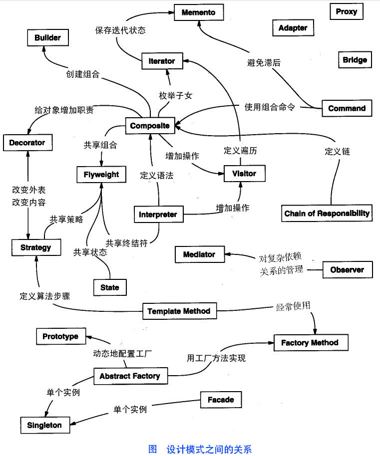

# 设计模式

|序号|模式|包括|英文名称|读音|代码入口|
|:----|:----|:----|:----|:----|:----|
|1|创建型模式|工厂模式|Factory Pattern| |[入口](factory_pattern/README.md)|
| | |抽象工厂模式|Abstract Factory Pattern| |[入口]()|
| | |单例模式|Singleton pattern| |[入口]()|
| | |建造者模式|Builder Pattern| |[入口]()|
| | |原型模式|Prototype Pattern| |[入口]()|
|2|结构性模式|适配器模式|Adapter Pattern| |[入口]()|
| | |桥接模式|Bridge Pattern| |[入口]()|
| | |过滤器模式|Filter、Criteria Pattern| |[入口]()|
| | |组合模式|Composite Pattern| |[入口]()|
| | |装饰器模式|Decorator Pattern| |[入口]()|
| | |外观模式|Facade Pattern| |[入口]()|
| | |享元模式|Flyweight Pattern| |[入口]()|
| | |代理模式|Proxy Pattern| |[入口]()|
|3|行为型模式|责任链模式|Chain of Responsibility Pattern| |[入口]()|
| | |命令模式|Command Pattern| |[入口]()|
| | |解释器模式|Interpreter Pattern| |[入口]()|
| | |迭代器模式|Iterator Pattern| |[入口]()|
| | |中介者模式|Mediator Pattern| |[入口]()|
| | |备忘录模式|Memento Pattern| |[入口]()|
| | |观察者模式|Observer Pattern| |[入口]()|
| | |状态模式|State Pattern| |[入口]()|
| | |空对象模式|Null Object Pattern| |[入口]()|
| | |策略模式|Strategy Pattern| |[入口]()|
| | |模板模式|Template Pattern| |[入口]()|
| | |访问者模式|Visitor Pattern| |[入口]()|
|4|J2EE模式|MVC模式|MVC Pattern| |[入口]()|
| | |业务代表模式|Business Delegate Pattern| |[入口]()|
| | |组合实体模式|Composite Entity Pattern| |[入口]()|
| | |数据访问对象模式|Data Access Object Pattern| |[入口]()|
| | |前段控制器模式|Front Controller Pattern| |[入口]()|
| | |拦截过滤器模式|Intercepting Filter Pattern| |[入口]()|
| | |服务定位器模式|Service Locator Pattern| |[入口]()|
| | |传输对象模式|Transfer Object Pattern| |[入口]()|

# 设计模式的六大原则

|序号|原则|简称|英文名称|读音|描述|
|:----|:----|:----|:----|:----|:----|
|1|开闭原则|OCP原则|Open Close Principle| |对扩展开放，对修改关闭。|
|2|里氏代换原则|LSP原则|Liskov Substitution Principle| |任何基类可以出现的地方，子类一定可以出现。|
|3|依赖倒转原则|DIP原则|Dependence Inversion Principle| |针对接口编程，依赖于抽象而不依赖与具体。|
|4|接口隔离原则|ISP原则|Interface Segregation Principle| |使用多个隔离的接口，比使用单个接口更好。降低类之间的耦合度。|
|5|迪米特法则，又称最少知道原则|DP原则|Demeter Principle| |一个实体应该尽量少的与其它实体之间发生相互作用，使得系统功能模块相对独立。|
6|合成复用原则|CRP原则|Composite Reuse Principle| |尽量使用合成/聚合的方式，而不是使用继承。|
