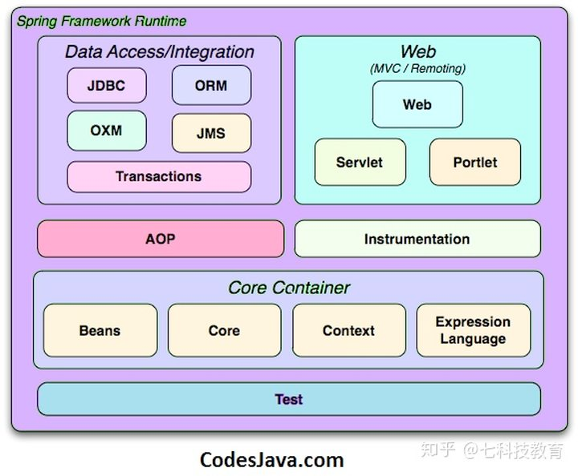

# Springboot

依赖注入（DI）

面向方面编程（AOP）

## 优点

    轻量级框架
        POJO模型
    非侵入性
    松散耦合
        依赖注入，弹簧对象，松散耦合
    模块化
    易于测试
    事务管理界面
        为事务管理提供事务管理接口
    不需要应用程序服务器
        如tomcat、Jetty
    MVC框架

## 核心容器

    CORE
        核心模块，提供了弹簧框架的基本功能，如IOC和DI
    Bean
        Bean模块，提供了BeanFactory
    Context
        上下文模块，提供了一种访问任何对象的方法。
        ApplicationContext 接口，是Context模块的主要部分
    Expression Language
        表达式语言模块，提供了一种在运行时操作对象的方法。

## 数据访问

    JDBC
        JDBC模块，提供JDBC抽象层
    ORM
        ORM模块，为对象关系映射API提供集成层，如JPA和Hibernate等
    OXM
        OXM模块，为对象/XMl映射API提供抽象层，如JAXB，Castor和XMLBeans等
    JMS
        JMS模块，提供消息处理功能
    Transaction
        事务模块，为POJO等类提供事务管理功能

## 网站

    Web模块
        由Web、Web-Servlet、Web-Struts、Web-Socket和Web-Protlet组成
        它们提供了创建Web应用程序的功能。

## AOP

    AOP
        AOP模块，提供面向方面的编程实现，提供了定义方法拦截器的工具。

## 仪器仪表

    Instrumenttation
        Instrumenttation模块，提供类检测支持和类加载器实现。

## Spring IOC 容器

    Spring IOC容器
        负责在整个生命周期中创建、连接、配置和管理对象。
        它使用配置元数据来创建、配置和管理对象。
        配置元数据可以由Spring配置XML文件或注释表示。

## 核心注解

    @SpringBootApplication
        @SpringBootConfiguration
            @Configuration
                读取spring.factories文件
        @EnableAutoConfiguration
            自动配置机制，自动导入
        @ComponentScan
            扫描包路径
    