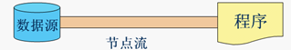
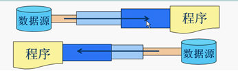

# IO 流

## BIO、NIO、AIO

    1、同步与异步

    同步就是发起一个调用后，被调用者未处理完请求之前，调用不返回。
    异步就是发起一个调用后，立刻得到被调用者的回应表示已接收到请求，但是被调用者并没有返回结果。
        此时我们可以处理其他请求，被调用者通常依靠事件、回调等机制来通知调用者其返回结果。
    区别：异步不需要等待处理结果，被调用者会通过回调等机制来通知调用者其返回结果。

    2、阻塞与非阻塞

    阻塞就是发起一个请求，调用者一直等待请求结果返回，
        也就是当前线程会被挂起，无法从事其他任务，只有当条件就绪才能继续
    非阻塞就是发起一个请求，调用者不用一直等着结果返回，可以先去干其他事情。

[BIO](bio/README.md)

### NIO (Non Blocking IO) 同步非阻塞模型

## 1、概念

    流是一组有顺序的，有起点和重点的字节集合，是对数据传输的总称或抽象。
    即数据在两设备间的传输称为流
    流的本质是数据传输

## 2、分类

    根据处理数据类型的不同 分为：字符流 和 字节流
    根据数据流向不同 分为：输入流 和 输出流
    根据处理对象不同 分为：节点流 和 处理流

### 2.1、字符流 和 字节流

    字符流的由来
        因为数据编码的不同，而有了对字符进行高效操作的流对象。
        本质就是基于字节流读取时，查询指定的码表。
    区别
        读写单位不同
            字节流以字节（8bit）为单位
            字符流以字符为单位，根据码表映射字符，一次可能读取多个字节。
        处理对象不同
            字节流能处理所有类型的数据（如图片、avi等）
            字符流只能处理字符类型的数据
        字节流一次读入或读出是8位二进制。
        字符流一次读入或读出是16位二进制。
    结论
        只要是处理纯文本数据，就优先考虑使用字符流。除此之外都使用字节流。

### 2.2、输入流 和 输出流

    输入流只能进行读操作
    输出流只能进行写操作

#### 2.2.1、输入字节流 InputStream

    InputStream 是所有的输入字节流的父类，抽象类。
    ByteArrayInputStream、StringBufferInputStream、FileInputStream 是三种基本的介质流。
        它们分别从 byte数组，StringBuffer 和 本地文件 中读取数据。
    PipedInputStream 是从与其它线程共用的管道中读取数据。
    ObjectInputStream 和 所有 FilterInputStream 的子类都是装饰流。

#### 2.2.2、输出字节流 OutputStream

    OutputStream 是所有的输出字节流的父类，抽象类。
    ByteArrayOutputStream、FileOutputStream 是两种基本的介质流，
        它们分别向 byte数组 和 本地文件 中写入数据。
    PipedOutputStream 是向与其它线程共用的管道中写入数据。
    ObjectOutputStream 和 所有 FilterOutputStream 的子类都是装饰流。

### 2.3、节点流 和 处理流

    节点流：直接与数据源相连，读入或读出。
        直接使用节点流，读写不方便，为了更快的读写文件，才有了处理流。

    处理流和节点流一块使用，在节点流的基础上，再套接一层，套接在节点流上的就是处理流。
        如 BufferedReader 处理流的构造方法总是要带一个其它的流对象做参数。
    一个流对象经过其它流的多次包装，称为流的链接。

#### 2.3.1、常用的节点流

|类型|字节输入流|字节输出流|字符输入流|字符输出流|用途|
|:----:|:----:|:----:|:----:|:----:|:----:|
|父类|InputStream|OutputStream|Reader|Writer| |
|文件|FileInputStream|FileOutputStream|FileReader|FileWrite|进行文件处理的节点流|
|数组|ByteArrayInputStream|ByteArrayOutputStream|CharArrayReader|CharArrayWriter|进行数组（内存中的数组）处理的节点流|
|字符串| | |StringReader|StringWriter|进行字符串处理的节点流|
|管道|PipedInputStream|PipedOutputStream|PipedReader|PipedWriter|进行管道处理的节点流|

#### 2.3.2、常用的处理流：

|类型|字节输入流|字节输出流|字符输入流|字符输出流|用途|
|:----:|:----:|:----:|:----:|:----:|:----:|
|缓冲流|BufferedInputStream|BufferedOutputStream|BufferedReader|BufferedWriter|增加缓冲功能，避免频繁读写硬盘|
|转换流| | |InputStreamReader|OutputStreamReader|实现字节流和字符流之间的转换|
|数据流|DataInputStream|DataOutputStream| | |提供将基础数据类型读写入文件中|

#### 2.3.2.1、转换流

    InputStreamReader、OutputStreamReader 要 InputStream 或 OutputStream 作为参数，
        实现从字节流到字符流的转换。
    改造函数
        通过构造函数初始化，使用的是本系统默认的编码表GBK。
            InputStreamReader(InputStream);
        通过该构造函数初始化，可以指定编码表。
            InputStreamReader(InputStream, String charSet);
        通过该构造函数初始化，使用的是本系统默认的编码表GBK。
            OutputStreamWriter(OutputStream);
        通过该构造函数初始化，可以指定编码表。
            OutputStreamWriter(OutputStream, String charSet);

## 3、常用流分类表

|分类|字节输入流|代码示例|字节输出流|代码示例|字符输入流|代码示例|字符输出流|代码示例|
|:----:|:----:|:----:|:----:|:----:|:----:|:----:|:----:|:----:|
|抽象基类|InputStream|[示例]()|OutputStream|[示例]()|Reader|[示例]()|Writer|[示例]()|
|访问文件|FileInputStream|[示例](file/FileStreamLearn.java)|FileOutputStream|[示例](file/FileStreamLearn.java)|FileReader|[示例](file/FileReaderLearn.java)|FileWriter|[示例](file/FileReaderLearn.java)|
|访问数组|ByteArrayInputStream|[示例](array/ByteArrayStreamLearn.java)|ByteArrayOutputStream|[示例](array/ByteArrayStreamLearn.java)|CharArrayReader|[示例](array/CharArrayStreamLearn.java)|CharArrayWriter|[示例](array/CharArrayStreamLearn.java)|
|访问管道|PipedInputStream|[示例]()|PipedOutputStream|[示例]()|PipedReader|[示例]()|PipedWriter|[示例]()|
|访问字符串|StringBufferInputStream|[示例]()| | |StringReader|[示例]()|StringWriter|[示例]()|
|缓冲流|BufferedInputStream|[示例]()|BufferedOutputStream|[示例]()|BufferedReader|[示例]()|BufferedWriter|[示例]()|
|转换流| | | | |InputStreamReader|[示例]()|OutputStreamWriter|[示例]()|
|对象流|ObjectInputStream|[示例]()|ObjectOutputStream|[示例]()| | | | |
|抽象基类|FilterInputStream|[示例]()|FilterOutputStream|[示例]()|FilterReader|[示例]()|FilterWriter|[示例]()|
|打印流| | |PrintStream|[示例]()| | |PrintWriter|[示例]()|
|推回输入流|PushbackInputStream|[示例]()| | |PushbackReader|[示例]()| | |
|特殊流|DataInputStream|[示例]()|DataOutputStream|[示例]()| | | | |
|队列流|SequenceInputStream|[示例]()| | | | | | |

