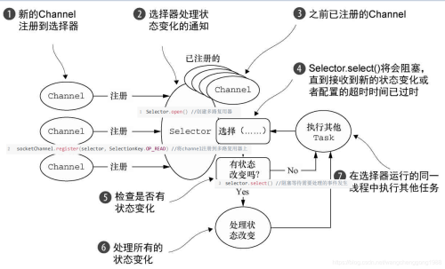

# NIO (Non Blocking IO) 同步非阻塞I/O模型

    同步非阻塞，服务器实现模式为一个线程可以处理多个连接请求
        客户端发送的连接请求都会注册到多路复用器 selector 上，
        多路复用器轮询到连接有IO请求就进行处理。

    NIO 方式适合连接数目多且连接比较短（轻操作）的架构，
        比如聊天服务器，弹幕系统，服务器之间通讯，编程相对复杂

    三大核心组件 Channel（通道）、Buffer（缓冲区）、Selector（多路复用器）
        channel 类似于流，每个 channel 对应一个buffer缓冲区，buffer底层是个数组
        channel 会注册到 selector 上，由 selector 根据 channel 读写事件的发生将其交由某个空闲的线程处理
        channel 和 buffer 可读写

[没有引入多路复用器的NIO，代码入口](NioServer.java)

[引入多路复用器的NIO，代码入口](NioSelectorServer.java)
