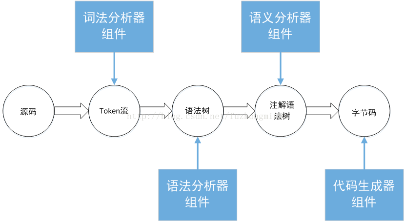

# 编译

Javac的任务就是将Java源代码编译成Java字节码，也就是JVM能够识别的二进制代码

表面上看是将.java文件转化为.class文件

实际上是将Java源代码转化成一连串二进制数字

这些二进制数字是有格式的，只有JVM能够真确的识别。

## 命令行

[详见命令行文件](COMMAND.md)

## 步骤

    1、词法分析器
        读取源代码，一个字节一个字节的读进来，找到这些词法中我们定义的语言关键词。
        结果：从源代码中找出了一些规范化的token流。
        例如：if、else、while
    2、语法分析器
        对词法分析中得到的token流进行语法分析
            检查这些关键词组合在一起是不是符合Java语言规范。
        结果：形成一个符合Java语言规定的抽象语法树
            抽象语法树是一个结构化的语法表达形式
            它的作用是把语言的主要词法用一个结构化的形式组织在一起
        例如：if 后面是不是跟着 布尔型 判断
    3、语义分析器
        把一些难懂的、复杂的语法转化成更简单的语法。
        或者是添加一些注释
        结果：对应到Java就是foreach转化为for循环，最后生成一颗注解语法树
            这颗语法树跟接近目标语言的语法规则
        例如：foreach转化为for循环
    4、字节码生成器
        根据经过注释的抽象生成字节码
        也就是将一个数据结构转化为另外一个数据结构

## 流程图

