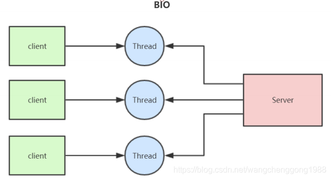
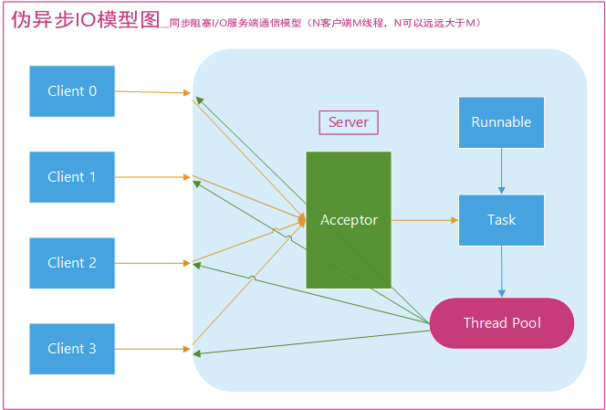

# BIO (Blocking IO) 同步阻塞I/O模型

    同步阻塞模型，一个客户端连接对应的一个处理线程
    对于每一个新的网络连接都会分配一个线程，每个线程都能独立处理自己负责的输入和输出。

    BIO方式适用于连接数目比较小而且固定的架构
    这种方式对服务器资源要求比较高，但程序简单易理解

### 伪异步IO 伪异步的IO通信框架

    后端通过一个线程池来处理多个客户端的请求接入，形成客户端个数 M ，线程池最大线程数 N 的比例关系，其中 M 可以远远大于 N 

[一请求一应答，代码入口](BioServer.java)

[多请求多应答，一对一，代码入口](BioServer2.java)