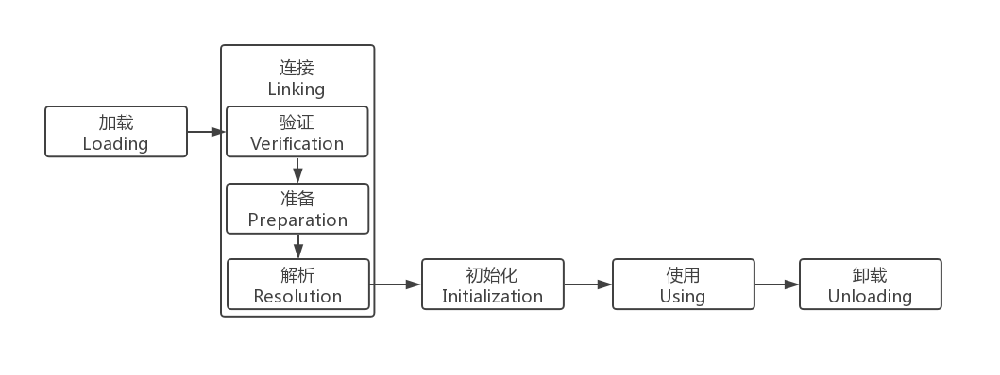
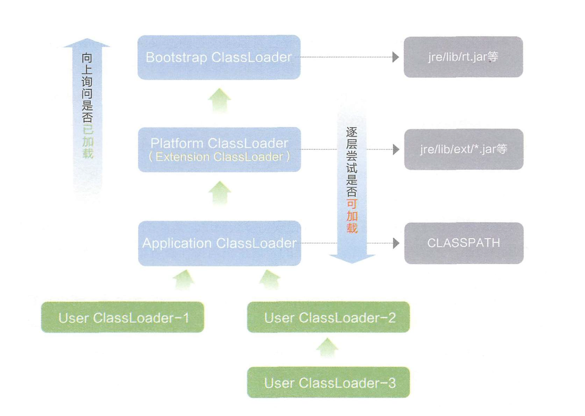

# Java虚拟机 类加载机制

虚拟机把描述类的数据从.class文件加载到内存，并对数据进行校验、转换、解析和初始化，

最终形成可以被虚拟机直接使用的Java类型

## 类的生命周期

为支持运行时绑定，解析过程在某些情况下，可以在初始化之后再开始。

除解析过程外的其他加载过程必须按照如图顺序进行。

### 1、加载 Loading

    1.1、通过全限定类名来获取定义此类的二进制字节流

    1.2、将这个字节流所代表的静态存储结构转化为方法区的运行时数据结构

    1.3、在内存中生成一个代表这个类的 java.lang.Class 对象，作为方法区这个类的各种数据的访问入口。

### 2、验证 Verification（连接 Linking 阶段的第一步）

确保 .class 文件的字节流中包含的信息符合当前虚拟机的要求，

并且不会危害虚拟机自身的安全。

可以使用 -Xverify:none 参数来关闭大部分的类验证措施，以缩短虚拟机类加载的时间。

    2.1、文件格式验证
        如是否以模数 0xCAFEBABE 开头、主次版本号是否在当前虚拟机处理范围之内、常量合理性验证等。
        此阶段保证输入的字节流能正确的解析并存储于方法区之内，格式上符合描述一个 Java类型信息的要求。
    
    2.2、元数据验证
        是否存在父类，父类的继承链是否正确，抽象类是否实现了其父类或接口之中要求实现的所有方法，字段、方法是否与父类产生矛盾等。
        此阶段保证不存在不符合 Java语言规范的元数据信息

    2.3、字节码验证
        通过数据流和控制器分析，确定程序语义是合法的、符合逻辑的。
        例如保证跳转指令不会跳转到方法体之外的字节码指令上。

    2.4、符号引用验证
        在解析阶段中发生，保证可以将符号引用转化为直接饮用。

### 3、准备 Preparation

为类变量分配内存并设置类变量初始值，这些变量所使用的的内存都将在方法区中进行分配。

### 4、解析 Resolution

虚拟机将常量池内的符号引用替换为直接引用的过程。

解析工作主要针对类或接口、字段、类方法、接口方法、方法类型、方法句柄、调用点限定符 这7类符号引用进行。

### 5、初始化 Initialization

#### 5.1、<clinit>() 方法

    <clinit>() 方法，是由编译器按语句在源文件中出现的顺序，依次自动收集类中的所有类变量的赋值动作和静态代码块中的语句合并产生的。
        （不包括构造器中的语句，构造器是初始化对象的，类加载完成后，创建对象时候将调用 <init>() 方法来初始化对象）
        静态语句块中只能访问到定义在静态语句块之前的变量，定义在它之后的变量，在前面的静态语句块可以赋值，但是不能访问
        
    <clinit>() 方法，不需要显式调用父类的初始化方法 <clinit>() 
        虚拟机会保证在子类的 <clinit>() 方法执行之前，父类的 <clinit>() 方法已经执行完毕，
        父类中定义的静态语句块要优先于子类的变量赋值操作。

    如果一个类中没有静态语句块，也没有对变量的赋值操作，那么编译器可以不为这个类生成 <clinit>()方法

    虚拟机保证一个类的 <clinit>()方法在多线程环境中被正确的加锁、同步。

#### 5.2、类加载的时机

对于初始化阶段，虚拟机规范规定了有且只有5中情况必须立即对类进行 初始化（而加载、验证、准备自然需要在此之前开始）

以下这5中场景中的行为称为对一个类进行主动引用。

    5.2.1、遇到 new、getstatic、putstatic、invokestatic 这四条字节码指令时，如果类没有进行初始化，则需要先触发其初始化。
        new 使用new实例化对象
        getstatic、putstatic 读取或设置一个类的静态字段
            （被final修饰的，已经在编译期把结果放入常量池的静态字段除外）
        invokestatic 调用一个类的静态方法。
    
    5.2.2、对类进行反射调用的时候，如果类没有进行过初始化，则需要先触发其初始化
    5.2.3、当初始化类的父类还没有进行过初始化，则需要先触发其父类的初始化。
        （而一个接口在初始化时，并不要求其父接口全部都完成了初始化）
    5.2.4、虚拟机启动时，用户需要指定一个要执行的主类（包含main()方法的那个类）
        虚拟机会先初始化这个主类。
    5.2.5、当使用 JDK1.7的动态语言支持时，如果一个 java.lang.invoke.MethodHandle 实例，
        最后的解析结果 REF_getStatic、REF_putStatic、REF_invokeStatic的方法句柄，
        并且这个方法句柄所对应的类没有进行过初始化，则需要先触发其初始化。todo

除此之外，所有的引用类的方式都不会触发初始化，称为被动引用

    1、通过子类引用父类的静态字段，不会导致子类初始化
    2、通过数组定义来引用类，不会触发此类的初始化。 MyClass[] mc = new MyClass[10];
    3、常量在编译阶段会存入调用类的常量池中，本质上并没有直接引用到定义常量的类，因此不会触发定义常量的类的初始化。

## 类加载器

    把实现类加载阶段中的 "通过全限定类名来获取定义此类的二进制字节流" 这个动作的代码模块称为 "类加载器"。

    将 .class 文件二进制数据放入方法区内，然后堆内（heep）中创建一个 java.lang.Class 对象，
    Class 对象封装了类在方法区内的数据结构，并且向开发者提供了访问方法区内的数据结构的接口。

### 1.1、类的唯一性和类加载器

    对于任意一个类，都需要由加载它的类加载器和这个类本身一同确立其在Java虚拟机中的唯一性。

### 1.2 双亲委派模型

如果一个类加载器收到了类加载的请求，

它首先不会自己尝试加载这个类，

而是把这个请求委派给父类加载器去完成，每一个层次的类加载器都是如此。

因此所有的加载请求最终都应该传动到顶层的启动类加载器中，

只有当父加载器反馈自己无法完成这个加载请求（它的搜索范围中没有找到所需要的类）时，

子加载器才会尝试自己去加载

加载器之间的父子关系，是使用组合关系来复用父加载器的代码。

    Bootstrap 类加载器，使用 C++实现的，虚拟机自身的一部分

    扩展类加载器和应用类加载器是独立于虚拟机外部的，为Java语言实现的，均继承自抽象类 java.lang.ClassLoader，开发者可以直接使用这两个类加载器。

    Application 类加载器对象，可以由 ClassLoader.getSystemClassLoader() 方法获取，为系统类加载器
        负责加载用户类路径（ClassPath）上所指定的类库
        如果应用程序中没有自定义过自己的类加载器，一般情况下这个就是程序中默认的类加载器。

### 1.3 自定义类加载器

    Java默认 ClassLoader，只加载指定目录下的 class，如果需要动态加载类到内存，
    例如要从远程网络下的类的二进制文件，然后调用这个类中的方法实现我的逻辑

    继承 java.lang.ClassLoader
    重写父类的 findClass() 方法

    JDK的loadClass()方法，在所有父类加载器无法加载的时候，会调用本身的 findClass() 方法来进行类加载，
    因此我们只需要重写 findClass() 方法找到类的二进制数据即可。

## new 一个对象过程中发生了什么

    1、确定类元信息是否存在
        当JVM接收到new指令时，首先在元空间内检查需要创建的类元信息是否存在。
        若不存在，那么在双亲委派模式下，使用当前类加载器以ClassLoader + 包名 + 类名 为key进行查找对应的 class文件。
            如果没有找到文件，则抛出 ClassNotFoundException 异常。
            如果找到，则进行类加载（加载、验证、准备、解析、初始化），并生成对应的Class类对象。
    2、分配对象内存
        首先计算对象占用空间大小，如果实例成员变量是引用变量，仅分配引用变量空间即可，即4个字节大小，接着在堆中划分一块内存给新对象。
        在分配内存空间时，需要进行同步操作，比如采用CAS（Compare And Swap）失败重试、区域加锁等方式保证分配操作的原子性。
    3、设定默认值
        成员变量值都需要设定为默认值，即各种不同形式的零值。
    4、设置对象头
        设置新对象的哈希码、GC信息、锁信息、对象所属的类元信息等。这个过程的具体设置方式取决于JVM实现。
    5、执行 init方法
        初始化成员变量，执行实例化代码块，调用类的构造方法，并把堆内对象的首地址赋值给引用变量。

    