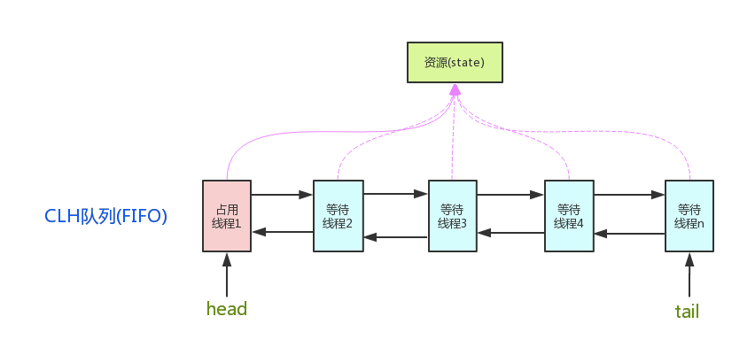

## 概述

AQS (AbstractQueuedSynchronizer)

抽象的队列式的同步器

## 框架

AQS 定义了一套多线程访问共享资源的同步器框架

> 1、资源(state)：volatile int state（共享资源）
>
>> a、资源的访问方式
>>
>>> getState()
>>
>>> setState()
>>
>>> compareAndSetState()
>>
>> b、资源的共享方式
>>
>>> Exclusive (独占，只有一个线程能执行，如ReentrantLock)
>>
>>> Share (共享，多个线程可同时执行，如Semaphore/CountDownLatch)
>
> 2、CLH队列(FIFO)：FIFO 线程等待队列（多线程争用资源被阻塞时会进入次队列）
>

### 自定义同步器

自定义同步器在实现时只需要实现共享资源state的获取与释放方式即可

AQS已经在顶层实现了 具体线程等待队列的维护（如获取资源失败入队、唤醒出队等）

自定义同步器需要实现以下几种方法

> boolean isHeldExclusively()
>> 该线程是否正在独占资源。只有用到condition才需要实现它。
>
> boolean tryAcquire(int arg)
>> 独占方式。尝试获取资源，成功则返回true，失败则返回false。
>
> boolean tryRelease(int arg)
>> 独占方式。尝试释放资源，成功则返回true，失败则返回false。
>
> int tryAcquireShared(int arg)
>> 共享方式。尝试获取资源。负数表示失败；0表示成功，但没有剩余可用资源；正数表示成功，并且有剩余资源。
>
> boolean tryReleaseShared(int arg)
>> 共享方式。尝试释放资源。如果释放后允许唤醒后续等待节点返回true，否则返回false

#### 以 ReentrantLock 为例

> 1、state 初始化为 0，表示未锁定状态。
>
> 2、A线程 lock() 时，会调用 tryAcquire() 独占该锁并将 state + 1
>
> 3、其他线程再 tryAcquire() 时就会失败，直到 A线程 unlock() 到 state = 0 （即释放锁）为止。
>
> 4、A线程 释放锁之前，可以重复获取此锁（state 会累加），这就是可重入概念
>> 获取多少次就要释放多少次，这样才能保证 state 能回到 0

#### 以 CountDownLatch 为例

> 1、任务分为 N 个子线程去执行，state 初始化为N（N与线程个数一致）
>
> 2、N 个子线程并发执行，每个子线程执行后 countDown() 依次，state 会 CAS 减 1。
>
> 3、所有子线程都执行完后 （即 state = 0），会 unpark() 主调用线程, 然后 主调用线程 就会从 await() 函数返回，继续余后动作。

## 源码详解

### Node 节点

Node节点 是对每一个等待获取资源的线程的封装， 其包含了需要同步的线程本身及其等待状态

#### 变量 waitStatus

变量 waitStatus 表示单签 Node节点 的等待状态

负值表示节点处于有效等待状态，

正值表示节点已经被取消。

所以源码中有很多地方使用 >0、<0 来判断节点的状态是否正常。

> 1、CANCELLED(1)
>> [ˈkænsld] 取消；作废；解约
>>
>> 表示当前节点已经取消调度。
>>
>> 当timeout或被中断（响应中断的情况），会触发变更为此状态。
>>
>> 进入该状态后的节点将不会再变化。
>
> 2、SIGNAL(-1)
>> [ˈsɪɡnəl] 标志；用信号通知；表示
>>
>> 表示后继节点在等待当前节点唤醒。
>>
>> 后续节点入队时，会将前继节点的状态更新为 SIGNAL
>
> 3、CONDITION(-2)
>> [kənˈdɪʃn] 决定；使适应；使健康；以…为条件
>>
>> 表示节点等待在 Condition 上，
>>
>> 当其他线程调用 Condition 的 signal() 后，
>>
>> CONDITION 状态的节点将会从等待队列转移到同步队列中，等待获取同步锁。
>
> 4、PROPAGATE(-3)
>> [ˈprɒpəɡeɪt] 传播；传送；繁殖；宣传
>>
>> 共享模式下，前继节点不仅会唤醒其后继节点，同时也可能会唤醒后继的后继节点。
>
> 5、0
>> 新节点入队时的默认状态