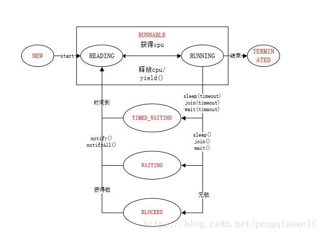

### 线程优先级

```java
@SuppressWarnings("all")
public class PriorityDemo {
    public static void main(String[] args) {
        Thread thread = new Thread() {
            @Override
            public void run() {
                System.out.printf("线程 %s 运行\n", Thread.currentThread().getName());
            }
        };
        // 线程执行有优先级，优先级越高先执行机会越大（但并不是一定先执行！！！）
        // 优先级用 int 修饰的 priority [prai'ɔrəti] 参数表示
        // 线程优先级，范围是 1 - 10，默认为 5
        thread.setPriority(5);
        thread.start();
    }
}
```

### 线程的状态

```java
public class Thread implements Runnable {
    public enum State {
        // 新建
        NEW,
        // 运行
        // 包含 就绪和运行 两种状态
        // 运行，获得了CPU时间片
        RUNNABLE,
        // 阻塞
        // 等待锁
        BLOCKED,
        // 等待
        // 无限期的主动等待，直到有线程唤醒它，才会再次进入就绪状态
        WAITING,
        // 超时等待
        // 有限期的主动等待，要么有线程唤醒它，要么等待一定时间，才会再次进入就绪状态
        TIMED_WAITING,
        // 终止
        TERMINATED
    }

    // 获取线程的状态
    public State getState() {
        return sun.misc.VM.toThreadState(threadStatus);
    }
}
```



### 构造器

Thread 类，对外提供了8个构造器，1个默认构造器，最终调用的都是init()函数

```java
public class Thread implements Runnable {

    public Thread() {
        init(null, null, "Thread-" + nextThreadNum(), 0);
    }

    public Thread(Runnable target) {
        init(null, target, "Thread-" + nextThreadNum(), 0);
    }

    Thread(Runnable target, AccessControlContext acc) {
        init(null, target, "Thread-" + nextThreadNum(), 0, acc, false);
    }

    public Thread(ThreadGroup group, Runnable target) {
        init(group, target, "Thread-" + nextThreadNum(), 0);
    }

    public Thread(String name) {
        init(null, null, name, 0);
    }

    public Thread(ThreadGroup group, String name) {
        init(group, null, name, 0);
    }

    public Thread(Runnable target, String name) {
        init(null, target, name, 0);
    }

    public Thread(ThreadGroup group, Runnable target, String name) {
        init(group, target, name, 0);
    }


    public Thread(ThreadGroup group, Runnable target, String name,
                  long stackSize) {
        init(group, target, name, stackSize);
    }

    /**
     *
     * @param g 指定当前线程的线程组，未指定时线程组为创建该线程所属的线程组，线程组可以用来管理一组线程，通过activeCount()来查看活动线程的数量。
     * @param target 指定运行其中的Runnable，或者是通过创建Thread的子类并重写run()方法。
     * @param name 线程的名称，不指定自动生成
     * @param stackSize 预期堆栈大小，不指定默认为0，0代表忽略这个属性。与平台相关，不建议使用该属性。
     */
    private void init(ThreadGroup g, Runnable target, String name, long stackSize) {
        init(g, target, name, stackSize, null, true);
    }

    private void init(ThreadGroup g,
                      Runnable target,
                      String name,
                      long stackSize,
                      AccessControlContext acc,
                      boolean inheritThreadLocals) {
        // 代码省略
    }
}
```

[代码入口](NewThreadDemo.java)

### 公共方法

```
01、Thread Thread.currentThread()
    获得当前线程的引用。获得当前线程后对其进行操作。
02、Thread.UncaughtExceptionHandler getDefaultUncaughtExceptionHandler()
    返回线程由于未捕获到异常而突然终止时调用的默认处理程序。
03、int Thread.activeCount()
    当前线程所在线程组中活动线程的数目。
04、void dumpStack()
    将当前线程的堆栈跟踪打印至标准错误流。
05、int enumerate(Thread[] tarray)
    将当前线程的线程组及其子组中的每一个活动线程复制到指定的数组中。
06、Map<Thread,StackTraceElement[]> getAllStackTraces()
    返回所有活动线程的堆栈跟踪的一个映射。
07、boolean holdsLock(Object obj)   
    当且仅当当前线程在指定的对象上保持监视器锁时，才返回 true。
08、boolean interrupted()
    测试当前线程是否已经中断。
09、void setDefaultUncaughtExceptionHandler(Thread.UncaughtExceptionHandler eh)
    设置当线程由于未捕获到异常而突然终止，并且没有为该线程定义其他处理程序时所调用的默认处理程序。
10、void sleep(long millis)
    休眠指定时间
11、void sleep(long millis, int nanos)  
    休眠指定时间
12、void yield()
    暂停当前正在执行的线程对象，并执行其他线程。意义不太大
13、void checkAccess()
    判定当前运行的线程是否有权修改该线程。
14、ClassLoader getContextClassLoader()
    返回该线程的上下文 ClassLoader。
15、long getId()
    返回该线程的标识符。
16、String getName()
    返回该线程的名称。
17、int getPriority()
    返回线程的优先级。
18、StackTraceElement[] getStackTrace()
    返回一个表示该线程堆栈转储的堆栈跟踪元素数组。
19、Thread.State getState()
    返回该线程的状态。
20、ThreadGroup getThreadGroup()
    返回该线程所属的线程组。
21、Thread.UncaughtExceptionHandler getUncaughtExceptionHandler()
    返回该线程由于未捕获到异常而突然终止时调用的处理程序。
22、void interrupt()
    中断线程。
23、boolean isAlive()
    测试线程是否处于活动状态。
24、boolean isDaemon()
    测试该线程是否为守护线程。
25、boolean isInterrupted()
    测试线程是否已经中断。
26、void join()
    等待该线程终止。
27、void join(long millis)
    等待该线程终止的时间最长为 millis 毫秒。
28、void join(long millis, int nanos)
    等待该线程终止的时间最长为 millis 毫秒 + nanos 纳秒。
29、void run()
    线程启动后执行的方法。
30、void setContextClassLoader(ClassLoader cl)
    设置该线程的上下文 ClassLoader。
31、void setDaemon(boolean on)
    将该线程标记为守护线程或用户线程。
32、void start()
    使该线程开始执行；Java 虚拟机调用该线程的 run 方法。
33、String toString()
    返回该线程的字符串表示形式，包括线程名称、优先级和线程组。
```

#### 1. public static native Thread currentThread();

```java
/**
 * JDK内 线程类
 */
public class Thread implements Runnable {
    // 本地静态方法，用户获取当前线程，返回线程对象
    public static native Thread currentThread();
}
```

```java
public class Test {
    public static void main(String[] args) {
        // 该方法是本地静态方法，用于获取当前线程，返回线程对象
        Thread currentThread = Thread.currentThread();
        System.out.println(currentThread.getName());
    }
}
```

#### 2. public void run() {...}

```java
/**
 * JDK内 线程类
 */
public class Thread implements Runnable {
    @Override
    public void run() {
        if (target != null) {
            target.run();
        }
    }
}
```

```java
public class Test {
    // Thread 中的 run() 方法
    private Runnable target;

    @Override
    public void run() {
        // 当target不为空时，执行target的run方法，
        // 若target为空，则需要重写此方法，方法内是业务逻辑
        if (target != null) {
            target.run();
        }
    }

    public static void main(String[] args) {
        // target为空，则需要重写此方法
        new Thread() {
            @Override
            public void run() { // 线程要执行的业务逻辑
                System.out.println("重写Thread父类的run方法");
            }
        }.start();
        // target不为空，执行Runnable的run方法
        new Thread(new Runnable() {
            @Override
            public void run() { // 线程要执行的业务逻辑
                System.out.println("实现Runnable接口的run方法");
            }
        }).start();
    }
}
```

#### 3.void start()

```java
/**
 * JDK内线程类
 */
public class Thread implements Runnable {
    public synchronized void start() {
        if (threadStatus != 0)
            throw new IllegalThreadStateException();
        group.add(this);
        boolean started = false;
        try {
            start0();
            started = true;
        } finally {
            try {
                if (!started) {
                    group.threadStartFailed(this);
                }
            } catch (Throwable ignore) {
            }
        }
    }

    private native void start0();
}
```

```java
public class Test {
    public static void main(String[] args) {
        // 生成了一个线程对象
        Thread thread = new Thread() {
            @Override
            public void run() { // 线程要执行的业务逻辑
                System.out.println("重写Thread父类的run方法");
            }
        };
        // 启动了一个线程对象，线程开始了
        // 没有经过 start() 启动的线程，只是一个线程对象，同其他Object对象
        // 经过 start() 启动的线程，才是一个真正的线程
        thread.start();
    }
}
```

### interrupt()

    改变中断状态，不会中断一个正在运行的线程
    
    给受阻塞的线程发一个中断信号，这样受阻塞线程就得以退出阻塞的状态。

    如果线程被Object.wait，Thread.join和Thread.sleep三种方法之一阻塞，
    此时调用该线程的 interrupt() 方法，
    那么该线程将抛出一个InterruptedException中断异常（该线程必须事先预备好处理此异常），
    从而提早的终结被阻塞状态。
    
    如果线程没有被阻塞，这时调用Interrupt()方法将不起作用，
    直到执行到wait()，sleep()，join()时，才会马上抛出InterruptedException。

## Thread.sleep() 同 Thread.yield()

Thread.sleep() 当前线程会交出处理器资源，也就是时间片，其它线程都可以去竞争时间片

Thread.yield() 当前线程会交出处理器资源，也就是时间片，同优先级的线程竞争时间片